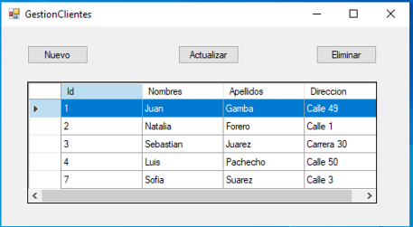
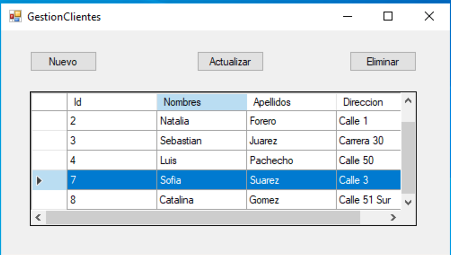
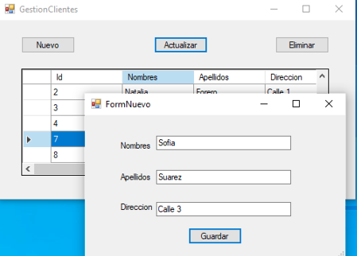
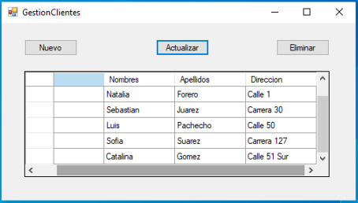
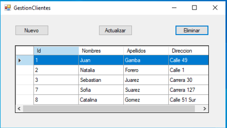

# CrudCliente

En este proyecto se realizo la función CRUD(Create,Read, Update, Delete) de la entidad cliente, la cual posee los atributos: Id, Nombres, Apellidos, Direccion. 

El proyecto se realizo en lenguaje C# a traves de la plataforma .NET

La solución se manejo con una arquitectura de tres capas, las cuales cumplen las siguientes funciones:
1. Presentacion : Contiene la vista al usuario usando la interfaz windows forms.
2. Entidades: Contiene las clases que interactuan en el proyecto, en este caso solo fue cliente.
3. Persistencia: Esta es la capa que realiza la interaccion con la base de datos, en este caso se uso una base de datos relacional en SQL Server.

# Funcionamiento del software:

## Crear cliente

Pantalla inicial:

Base de datos con cliente agregado:

## Actualizar datos de cliente

Seleccionar cliente para actualizar:

Se modifican los datos en el formulario:

Datos actualizados en la base de datos:

## Eliminar Cliente

Seleccionar cliente a eliminar:

Cliente eliminado de la base de datos:

